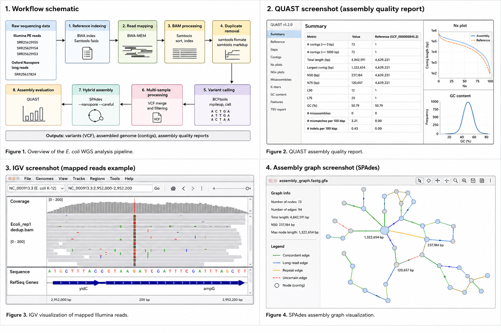

# E. coli Read Mapping, Variant Calling and Hybrid Assembly Pipeline

Bioinformatics workflow for bacterial whole-genome sequencing (WGS) data analysis using Illumina short reads and Oxford Nanopore long reads.

This project demonstrates:
- reference genome indexing,
- read mapping with BWA-MEM,
- BAM processing with Samtools,
- PCR duplicate removal,
- SNV calling with BCFtools,
- multi-sample variant processing,
- hybrid de novo genome assembly with SPAdes,
- assembly quality assessment with QUAST.

---

# Project Overview

## Organism
*Escherichia coli* K-12

## Sequencing datasets

### Illumina paired-end reads
- SRR25629155
- SRR25629154
- SRR25629153

### Oxford Nanopore long reads
- SRR25637824

## Reference genome
RefSeq: GCF_000005845.2

---

# Pipeline Summary

FASTQ preprocessing → BWA-MEM mapping → BAM processing → duplicate removal → SNV calling → VCF merging → hybrid assembly → QUAST evaluation

## Workflow Overview



---
## Quality Control

Raw sequencing reads were assessed using FastQC and aggregated using MultiQC.

Quality control evaluation included:
- per base sequence quality,
- GC content distribution,
- duplication levels,
- adapter contamination,
- sequence length distribution.

Reads were trimmed using Trimmomatic prior to downstream analyses.

Comparison of biological replicates revealed differences in duplication levels between samples, particularly in reverse reads.
___
## Skills Demonstrated

- NGS quality control
- FASTQ preprocessing
- Read trimming with Trimmomatic
- Reference genome indexing
- Short-read mapping with BWA-MEM
- SAM/BAM processing using Samtools
- PCR duplicate removal
- Variant calling with BCFtools
- Hybrid genome assembly with SPAdes
- Assembly quality assessment with QUAST
- Bash workflow automation
- Linux command-line bioinformatics
- Conda environment management
___

## Reproducibility

The analysis was performed using Conda-managed environments to ensure computational reproducibility.

Key bioinformatics tools used in this project include:
- BWA
- Samtools
- BCFtools
- Trimmomatic
- SPAdes
- QUAST
- FastQC
- MultiQC
___

# Workflow

## 1. Reference Genome Indexing

Reference genome indexing was performed using BWA and Samtools.

Generated index files:
- `.amb`
- `.ann`
- `.bwt`
- `.pac`
- `.sa`
- `.fai`

Script:

```bash
scripts/index_reference.sh
```

---

## 2. Read Mapping with BWA-MEM

Trimmed paired-end Illumina reads were mapped to the *E. coli* K-12 reference genome using BWA-MEM.

Script:

```bash
scripts/map_rep1_bwa.sh
```

Output preview:

```text
results/SAM.txt
```

---

## 3. BAM Processing with Samtools

SAM files were converted to BAM format, sorted, and indexed using Samtools.

Script:

```bash
scripts/samtools_processing.sh
```

Output preview:

```text
results/BAM.txt
```

---

## 4. PCR Duplicate Removal

PCR duplicates were removed using:
- `samtools fixmate`
- `samtools markdup`

Script:

```bash
scripts/remove_duplicates.sh
```

Final processed BAM:

```text
Ecoli_rep1_dedup.bam
```

---

## 5. Multi-sample Mapping Pipeline

Automated mapping and BAM processing for additional biological replicates:
- SRR25629154
- SRR25629153

Pipeline steps:
- BWA-MEM mapping
- BAM conversion
- read-name sorting
- fixmate processing
- coordinate sorting
- BAM indexing
- duplicate removal

Script:

```bash
scripts/mapping.sh
```

---

## 6. Variant Calling with BCFtools

Variant calling workflow:
1. `bcftools mpileup`
2. `bcftools call`

Parameters:
- minimum base quality: `-q 20`
- minimum mapping quality: `-Q 30`
- haploid ploidy model: `--ploidy 1`

Scripts:

```bash
scripts/bcftools_mpileup_rep1.sh
scripts/bcftools_call_rep1.sh
scripts/variant.sh
scripts/merge_vcfs.sh
```

Variant preview:

```text
results/variants_1.txt
```

---

## 7. Hybrid Genome Assembly with SPAdes

Hybrid de novo genome assembly was performed using:
- Illumina paired-end reads
- Oxford Nanopore long reads

SPAdes options:
- `--nanopore`
- `--careful`

Script:

```bash
scripts/hybrid_assembly_spades.sh
```

Assembly output summary:

```text
results/spades_output_files.txt
```

---

## 8. Assembly Quality Assessment with QUAST

Assembly quality evaluation was performed using QUAST.

Script:

```bash
scripts/quast_analysis.sh
```

Included reports:

```text
results/report.pdf
results/report.tsv
results/report.txt
results/icarus.html
```

### Selected assembly metrics

- **N50** — contig length such that contigs of this length or longer cover at least 50% of the assembly.
- **L50** — minimum number of contigs required to cover 50% of the assembly.

---

# Repository Structure

```text
ecoli-read-mapping-pipeline/
├── docs/
├── figures/
├── results/
└── scripts/
```

---

# Notes

Large raw sequencing and intermediate analysis files are excluded from this repository:
- FASTQ
- BAM
- BCF
- compressed VCF files

The repository focuses on:
- reproducible workflows,
- analysis scripts,
- lightweight result previews,
- assembly quality reports.

---

# Tools and Software

- BWA
- Samtools
- BCFtools
- SPAdes
- QUAST
- Bash
- Linux / WSL

---

# Author

Alicja Stachura-Matyjewicz, PhD  
Medical Laboratory Genetics Specialist  
Computational Genomics Portfolio Project
